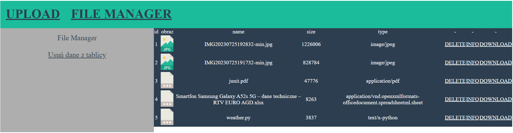

# Simple project manager application

<p align="center">
    
</p>

### Example of simple project manager app in express.js with usage of handlebars and formidable node pack.

## Run Locally:

Clone the repository and perform the following command line actions:

```bash
npm install
npm run start
```
Next open http://localhost:3000 in browser
